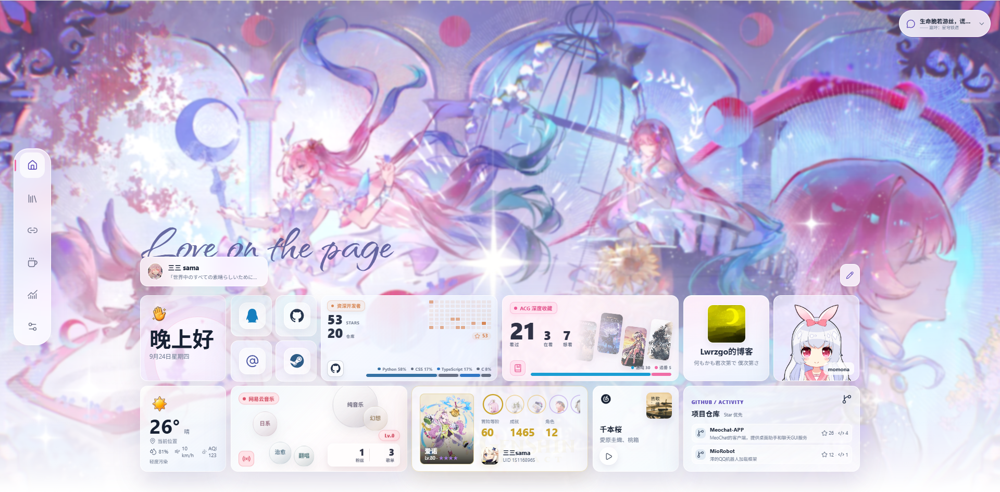
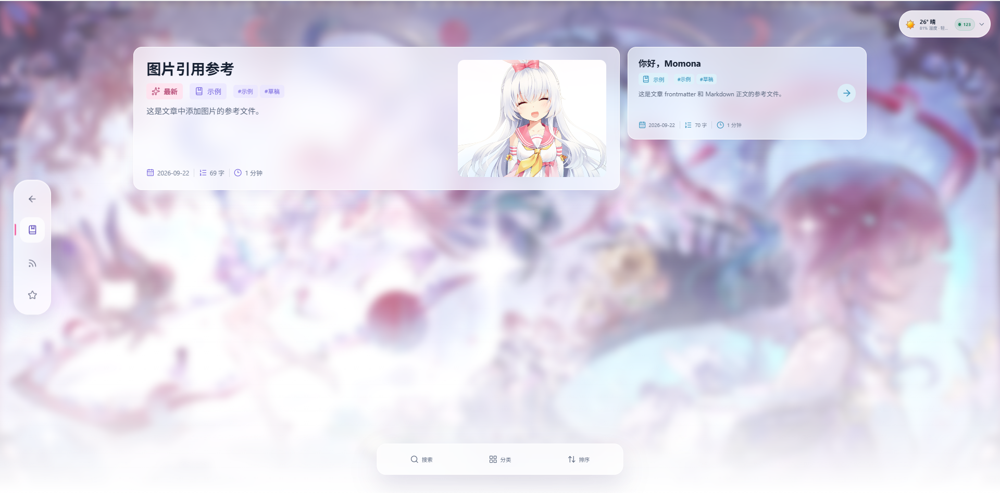
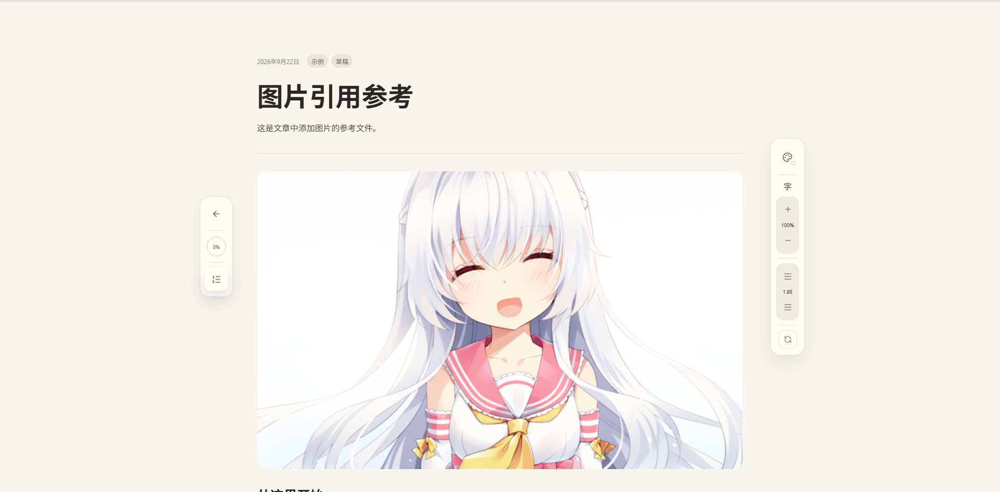
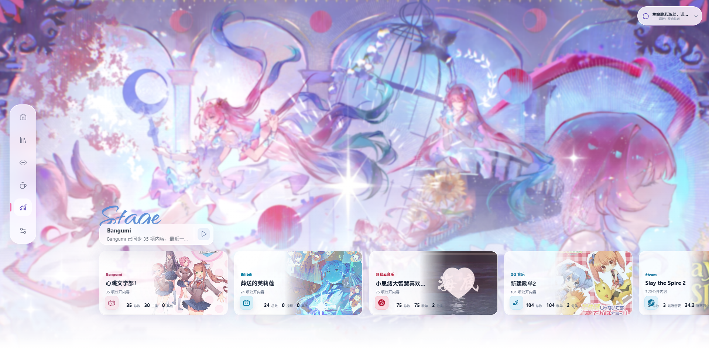

<div align="center">
  
  <h1>Momona</h1>
  <p>本地生成、静态部署的个人数字生活展示博客</p>
  <p>
    <a href="https://github.com/Mios-dream/momona">项目仓库</a>
    · <a href="#博客预览">页面预览</a>
    · <a href="#快速开始">快速开始</a>
    · <a href="#配置说明">配置说明</a>
  </p>
</div>

<div align="center">

[](https://nodejs.org/)
[](https://pnpm.io/)
[](https://astro.build/)
[](https://vuejs.org/)
[](https://www.typescriptlang.org/)
[](./LICENSE)

</div>

Momona 把个人资料、公开动态、收藏、友联、音乐和数据摘要整理到一个响应式站点中。它面向单用户本地编辑：开发阶段通过设置页配置与同步数据，发布阶段只输出纯静态文件，不需要在线数据库或运行中的后端服务。
参考 [Myriad](https://github.com/Myriad-You/Myriad) 进行页面构建。

> [!NOTE]
> Momona 的设置页和 `/__momona/*` 本地接口只在 Astro 开发服务器中提供。生产构建只读取项目文件和公开页面快照，不会把本地设置接口输出到 `dist/`。

⚡ **静态站点**：Astro 生成独立 HTML 页面，可部署到 GitHub Pages、Cloudflare Pages、Netlify、Nginx 或其他静态文件服务器。

🎛️ **本地编辑**：在 `/settings` 中管理站点身份、首页组件、友联、数据来源和同步状态。

🔗 **数据聚合**：将 Bangumi、Bilibili、GitHub、Steam、SFACG、网易云音乐和 QQ 音乐的公开内容投影到统一页面。

🔒 **隐私优先**：凭据和原始响应留在被 Git 忽略的 `.momona/` 中，公开快照只写入当前选择展示的内容。

## 🖼️ 博客预览

<table width="100%" align="center">
  <tr>
    <td align="center" width="50%">
      
      <br />首页控制面板
    </td>
    <td align="center" width="50%">
      
      <br />我的文章
    </td>
  </tr>
  <tr>
    <td align="center" width="50%">
      
      <br />文章详情与阅读工具
    </td>
    <td align="center" width="50%">
      
      <br />个人数字生活数据报告
    </td>
  </tr>
</table>

## ✨ 功能特性

### 核心体验

- [x] **个人首页控制面板**：展示资料、社交链接、动态、天气、音乐、游戏和项目活动。
- [x] **可编辑首页布局**：调整组件显示状态、顺序和网格尺寸，桌面端与移动端分别适配。
- [x] **资料库画布**：按类型筛选收藏内容，支持拖拽、缩放和重置视图。
- [x] **Brew 阅读空间**：聚合友联 RSS / Atom 订阅源与本地文章，支持搜索、筛选、排序和文章阅读。
- [x] **阅读体验**：文章详情页提供目录、阅读进度、字号、行高和主题切换等工具。
- [x] **数据报告**：按来源展示同步状态、指标摘要和平台数据卡片。

### 数据与编辑

- [x] **多来源同步**：按来源和内容类型单独启用同步，失败来源不会清空已有快照。
- [x] **本地设置页**：集中管理站点资料、友联、音乐、来源凭据和公开内容范围。
- [x] **Markdown 文章集合**：使用 Astro 内容集合管理文章、标签、分类、封面和草稿状态。
- [x] **静态发布**：构建后不依赖在线数据库或运行中的 Node 服务，适合部署到任意静态托管平台。
- [x] **凭据隔离**：来源 Token 单独写入 `.momona/credentials.json`，不会进入公开页面快照。

## 📄 页面与路由

| 页面       | 路径           | 内容                                       | 运行范围    |
| :--------- | :------------- | :----------------------------------------- | :---------- |
| 首页       | `/`            | 个人资料、活动、天气、音乐、游戏和项目活动 | 开发 / 生产 |
| 资料库     | `/library`     | 可筛选、拖拽、缩放和重置的收藏画布         | 开发 / 生产 |
| 友联       | `/friends`     | 友联列表和订阅源配置结果                   | 开发 / 生产 |
| Brew 阅读  | `/brew`        | RSS / Atom 订阅源、本地文章、筛选和搜索    | 开发 / 生产 |
| 文章详情   | `/blog/<slug>` | Markdown 文章正文、目录和阅读工具          | 开发 / 生产 |
| 数据报告   | `/reports`     | 数据指标、来源摘要和报告卡片               | 开发 / 生产 |
| 本地设置   | `/settings`    | 基础设置、数据管理和同步状态               | 仅开发      |
| 未找到页面 | `/404`         | 静态构建中的 404 页面                      | 生产构建    |

`/settings` 和 `/__momona/*` 由开发期集成注入，生产构建不会生成这些页面或接口。

## 🚀 快速开始

### 环境要求

- Node.js `>= 22.12.0`
- pnpm `>= 11`
- 同步数据来源时，需要能够访问对应公开服务的网络环境

### 本地开发

```powershell
git clone https://github.com/Mios-dream/momona.git
cd momona
pnpm install
pnpm dev
```

### 同步数据

本地开发时可以在设置页保存配置并单独同步来源，也可以在命令行执行完整同步：

```powershell
pnpm momona:sync
```

同步流程会读取 `.momona/localConfig.json`，更新友联订阅缓存和各数据来源快照，最后写入 `.momona/generated.json`。构建前执行一次同步即可把最新的公开投影带入静态页面。

## ⚙️ 配置说明

### 本地配置与环境变量

在 CI 或其他无本地文件的环境中，也可以通过 `MOMONA_CONFIG_JSON` 提供同样结构的 JSON。环境变量配置优先于 `.momona/localConfig.json`，缺失字段会使用默认值：

```json
{
  "sources": {
    "steam": {
      "enabled": true,
      "username": "76561198863810095",
      "token": "STEAM_WEB_API_KEY",
      "content": {
        "steamRecentGames": true,
        "steamLibrary": true
      }
    }
  }
}
```

### 数据来源

设置页可以按来源启用同步，并进一步选择需要写入公开快照的内容类型。

| 来源                                  | 配置标识   | 可同步内容与备注                                                              |
| :------------------------------------ | :--------- | :---------------------------------------------------------------------------- |
| [Bangumi](https://bgm.tv/)            | `bangumi`  | 追番、游戏、书籍和音乐收藏                                                    |
| [Bilibili](https://www.bilibili.com/) | `bilibili` | 投稿视频、公开收藏夹、追番 / 追剧                                             |
| [GitHub](https://github.com/)         | `github`   | 全部公开仓库或 Pinned 仓库，可按更新时间、Stars、Forks 或名称排序；Token 可选 |
| [Steam](https://steamcommunity.com/)  | `steam`    | 最近游玩和近两周时长；填写 Web API Key 后可同步游戏库                         |
| [SFACG](https://p.sfacg.com/)         | `sfacg`    | 输入公开书架地址，同步书架中的小说                                            |
| 网易云音乐                            | `netease`  | 喜欢的音乐、创建的歌单和收藏的歌单                                            |
| QQ 音乐                               | `qqmusic`  | 喜欢的音乐、创建的歌单和收藏的歌单                                            |

### 文章 Frontmatter

文章放在 `src/content/articles/` 下，支持 `.md` 和 `.mdx` 文件。每篇文章的 Frontmatter 至少需要标题和发布日期：

```yaml
---
title: "我的第一篇文章"
description: "文章摘要"
pubDate: 2026-09-24
updatedDate: 2026-09-24
category: "随笔"
tags:
  - 示例
  - Momona
cover: "./cover.png"
draft: false
---
```

目录中的图片可以通过相对路径引用；`draft: true` 的文章不会生成列表和详情页。例如：

```text
src/content/articles/
├── example.md
└── my-article/
    ├── article.md
    └── cover.png
```

## 📦 构建与部署

### 检查与构建

```powershell
pnpm astro check
pnpm build
pnpm preview
```

如果需要更新来源数据，请先执行 `pnpm momona:sync` 再构建。构建产物位于 `dist/`，`pnpm preview` 会在本地启动静态构建预览。

### 静态托管

可以将 `dist/` 部署到 GitHub Pages、Cloudflare Pages、Netlify、Nginx 或其他静态文件服务器。部署到非根路径时，在构建前设置站点地址和基础路径：

```powershell
$env:ASTRO_SITE = "https://example.com"
$env:ASTRO_BASE = "/momona"
pnpm build
```

需要 GitHub Pages 时，可以在 GitHub Actions 的 “New workflow” 中选择 `Deploy Momona to GitHub Pages`，或者复制 `.github/workflow-templates/deploy-pages.yml` 到 `.github/workflows/` 后按需调整。

使用模板前：

1. 在仓库 Settings → Pages → Build and deployment 中选择 GitHub Actions。
2. 个性化数据可以在自己的私有实例仓库中提供不含 Token 的 `.momona/localConfig.json`，或配置 `MOMONA_CONFIG_JSON` 仓库 Secret。
3. 项目 Pages 默认使用 `https://<owner>.github.io/<repository>/`；用户主页仓库需要将模板中的 `ASTRO_BASE` 改为 `/`。

## 🔐 本地数据与隐私

`.momona/` 用于本机开发和构建。

```text
.momona/
├── localConfig.example.json # 可复制的公开配置示例
├── localConfig.json         # 本地配置，不提交
├── credentials.json         # 来源凭据，不提交
├── generated.json           # 公开页面快照，不提交
├── brew-feeds.json          # RSS / Atom 文章缓存，不提交
└── sources/                 # 来源原始响应与派生缓存，不提交
```

## 🗂️ 项目结构

```text
.
├── src/
│   ├── components/                 # Vue 页面与可复用组件
│   ├── composables/                # 画布、拖拽、缩放等交互逻辑
│   ├── content/articles/            # Markdown 文章集合
│   ├── data/                       # 类型、默认数据和页面配置
│   ├── layouts/                    # Astro 页面布局
│   ├── lib/dataCenter/             # 构建期统一数据入口
│   ├── lib/dataSources/            # 数据源适配器和快照转换
│   ├── pages/                      # 生产静态路由
│   └── routes/settings.astro       # 仅开发期注入的设置页
├── public/assets/                  # 图片、字体和游戏资源
├── docs/assets/                    # README 预览截图
├── scripts/sync-data.ts            # 命令行同步入口
├── .github/workflows/ci.yml        # 类型检查与构建检查
├── astro.config.mjs                # Astro 与 Vue 集成配置
├── package.json                    # 脚本和依赖
├── LICENSE                         # AGPL-3.0-only 许可证
└── .momona/                        # 本地配置和页面快照
```

## 🤝 参与贡献

欢迎提交 Issue 或 Pull Request。提交代码前建议：

1. 使用 pnpm 安装和管理依赖。
2. 保持数据源适配器的错误处理和公开数据边界。
3. 运行 `pnpm astro check` 和 `pnpm build`。
4. 不要提交 `.momona/`、`dist/`、`.astro/` 或包含令牌的文件。

## 📜 许可证

除另有说明外，本仓库的原创源代码采用 [GNU Affero General Public License v3.0 only](LICENSE)。

字体、图片、游戏 Logo、Live2D 运行时和其他第三方资源不适用 AGPL。发布项目或构建产物前，请确认这些资源的来源、许可证和分发权限；相关许可信息见 [`licenses/`](./licenses)。

## 🙏 致谢

- [Myriad](https://github.com/Myriad-You/Myriad)：提供页面视觉和交互模式参考。
